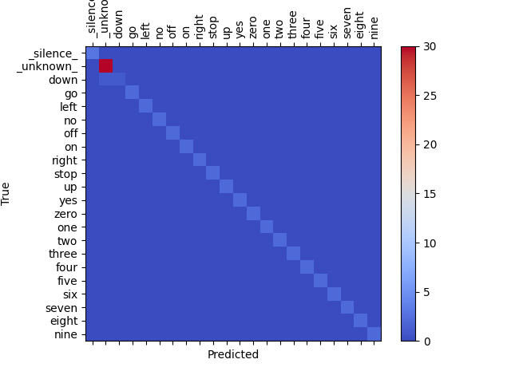
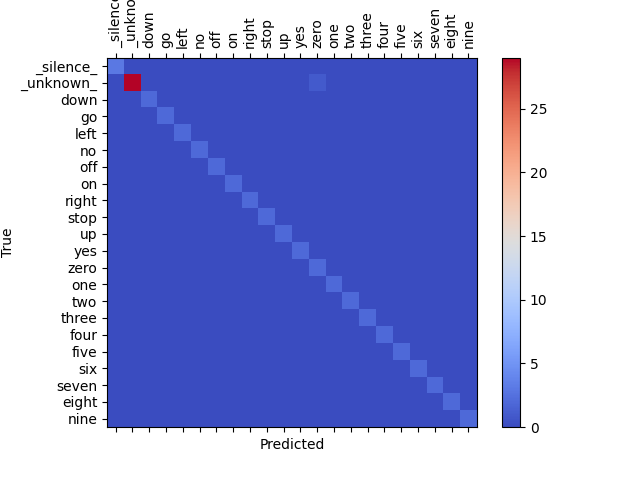

# System sterowania grami za pomocą komend głosowych.

Celem projektu jest stworzenie systemu, który pozwala na sterowanie grami za pomocą komend głosowych. Działanie systemu polega na rozpoznawaniu komend głosowych, a następnie mapowaniu ich na odpowiednie klawisze klawiatury. Na przykład, jeśli użytkownik wypowie słowo *skok*, to system powinien wysłać do gry sygnał równoważny z naciśnięciem klawisza *spacja*.

## Źródła
[Broadcasted Residual Learning for Efficient Keyword Spotting](https://arxiv.org/pdf/2106.04140v4)\
Autorzy: Byeonggeun Kim, Simyung Chang, Jinkyu Lee, Dooyong Sung

## Instalacja
Sklonuj repozytorium i wejdź do katalogu z projektem:
```bash
git clone https://github.com/Eniterusx/game-voice-controller.git
cd game-voice-controller
```

Stwórz wirtualne środowisko conda i zainstaluj wymagane biblioteki:
```bash
conda create -n bcresnet python=3.8
cond activate bcresnet
conda install pytorch==1.7.1 torchvision==0.8.2 torchaudio==0.7.2 -c pytorch
conda install tqdm, requests
pip install soundfile
```
Zbiór danych można pobrać dodając flagę `--download` podczas uruchamiania skryptu `main.py`.

## Zbiór danych
### Google Speech Commands Dataset

Wersja 1: [[Train]](https://storage.googleapis.com/download.tensorflow.org/data/speech_commands_v0.01.tar.gz) [[Test]](https://storage.googleapis.com/download.tensorflow.org/data/speech_commands_test_set_v0.01.tar.gz)

Wersja 2: [[Train]](http://download.tensorflow.org/data/speech_commands_v0.02.tar.gz) [[Test]](http://download.tensorflow.org/data/speech_commands_test_set_v0.02.tar.gz)

## Rezultaty
#### Zbiór danych Google Speech Commands Dataset v0.02, 100 epok dla każdego modelu
| Model (tau) | Procent zbioru danych [średnia liczba komend na klasę] | Dokładność |
|-|-|-|
| 3 | 100% [4030 komend] | 97.721% |
| 3 | 50% [2015 komend] | 97.003% |
| 3 | 30% [1209 komend] | 97.051% |
| 3 | 25% [1008 komend] | 96.141% |

## Własny zbiór danych
Stworzony przeze mnie zbiór danych zawiera po 10 nagrań mojego głosu dla każdej z 20 komend oraz 150 nagrań dla klasy `_unknown_` (komendy nie należące do zbioru 20 komend). Zbiór danych został podzielony na 60% danych treningowych, 20% danych ewaluacyjnych oraz 20% danych testowych.

### Model (tau): 1.5
##### Accuracy: 90.278%


### Model (tau): 2
##### Accuracy: 97.222%


### Model (tau): 3
##### Accuracy: 94.444%


Eksperymenty przeprowadzone na własnym zbiorze danych nie przyniosły zadowalających rezultatów. Model stosunkowo często myli podobne słowa. Chociaż jeden z modeli osiągnął accuracy na poziomie 97.222% na danych testowych, to podczas testów na strumieniu audio modele miały trudność z rozpoznawaniem komend, często myląc je ze sobą lub nie rozpoznając ich wcale.