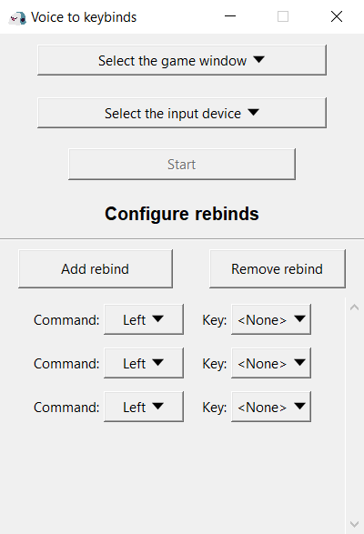
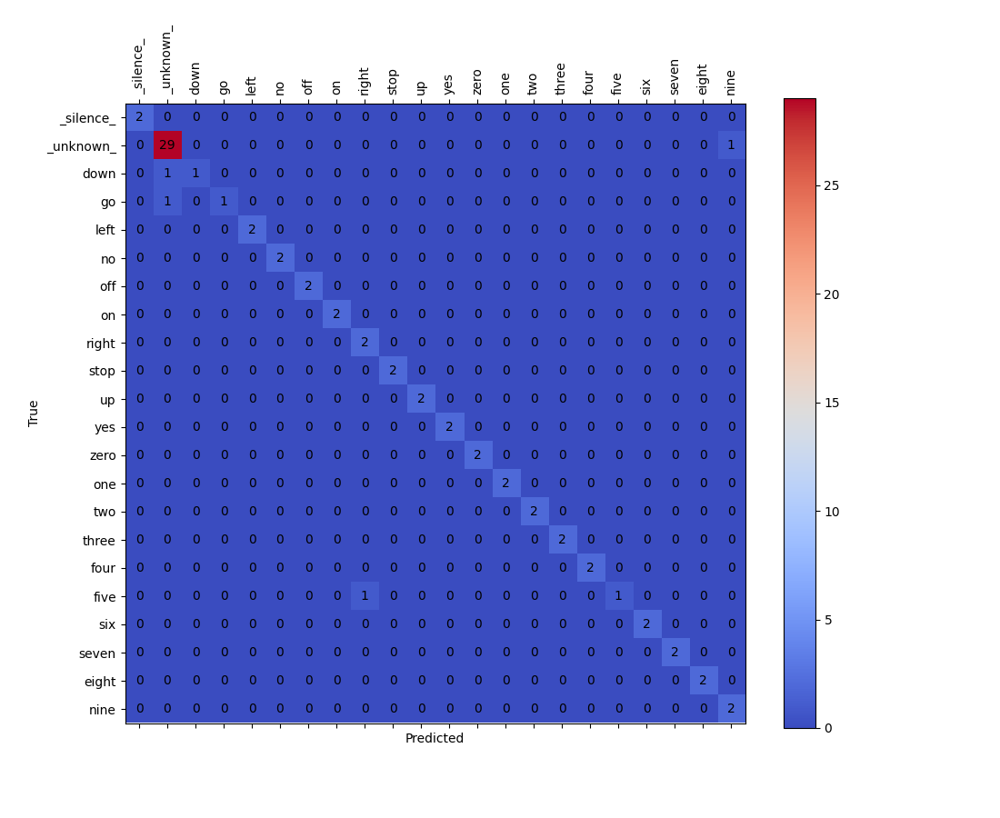

# System sterowania grami za pomocą komend głosowych.

## Spis treści
1. [Opis projektu](#opis-projektu)
2. [Źródła](#źródła)
3. [Wymagania](#wymagania)
4. [Instalacja aplikacji](#instalacja-aplikacji)
    - [Linux](#linux)
    - [Windows](#windows)
5. [Uruchomienie aplikacji](#uruchomienie-aplikacji)
6. [Przykładowe działanie](#przykładowe-działanie)
7. [Instalacja modelu](#instalacja-modelu)
    - [Linux](#linux-1)
    - [Windows](#windows-1)
8. [Uruchomienie modelu](#uruchomienie-modelu)
9. [Zbiór danych](#zbiór-danych)
    - [Google Speech Commands Dataset](#google-speech-commands-dataset)
10. [Rezultaty](#rezultaty)
    - [Zbiór danych Google Speech Commands Dataset v0.02](#zbiór-danych-google-speech-commands-dataset-v002)
    - [Własny zbiór danych](#własny-zbiór-danych)
    - [Fine-tuning](#fine-tuning)

## Opis projektu
Celem projektu jest stworzenie systemu, który pozwala na sterowanie grami za pomocą komend głosowych. Działanie systemu polega na rozpoznawaniu komend głosowych, a następnie mapowaniu ich na odpowiednie klawisze klawiatury. Na przykład, jeśli użytkownik wypowie słowo *Yes*, to system powinien wysłać do gry sygnał równoważny z naciśnięciem klawisza *enter*. Program rozpoznaje komendy w języku angielskim.

W celu rozpoznawania komend głosowych wykorzystany został model Keyword Spotting (KWS), który jest w stanie w czasie rzeczywistym rozpoznawać predefiniowane komendy głosowe. W projekcie wykorzystano model Broadcasted Residual Learning (BCResNet), który jest w stanie rozpoznać komendy z dokładnością na poziomie 96.840% dla zbioru danych Google Speech Commands Dataset v0.02. Aby zredukować ilość wykonywanych obliczeń, model wykorzystuje Voice Activity Detection (VAD), który pozwala na rozpoznawanie komend tylko wtedy, gdy użytkownik mówi.

Oprócz tego przeprowadzone zostały eksperymenty testujące możliwości modelu, w szczególności przetestowanie modelu na własnym zbiorze danych, który zawiera 10 nagrań dla każdej z 20 komend oraz 150 nagrań dla klasy `_unknown_`. Model osiągnął dokładność na poziomie 97.222% dla jednego z eksperymentów.

## Źródła
[Broadcasted Residual Learning for Efficient Keyword Spotting](https://arxiv.org/pdf/2106.04140v4)\
Autorzy: Byeonggeun Kim, Simyung Chang, Jinkyu Lee, Dooyong Sung

## Wymagania:
- python 3.8.19
- conda

## Instalacja aplikacji
### Linux
Sklonuj repozytorium i wejdź do katalogu setup/app, a następnie uruchom setup_app.sh
```bash
git clone https://github.com/Eniterusx/game-voice-controller.git
cd game-voice-controller/setup/app
./setup_app.sh
```


### Windows
Sklonuj repozytorium i wejdź do katalogu projektu
```bash
git clone https://github.com/Eniterusx/game-voice-controller.git
cd game-voice-controller
```
Stwórz wirtualne środowisko conda i zainstaluj wymagane biblioteki
```bash
conda create -n bcresnet_app python=3.8.19
conda activate bcresnet_app
conda install pytorch==1.7.1 torchvision==0.8.2 torchaudio==0.7.2 -c pytorch
pip install sounddevice webrtcvad pyautogui
# ze względu na problemy z biblioteką pillow na systemie Windows, zaleca się instalację wersji 9.2.0
conda remove pillow --force
pip install pillow==9.2.0
```

### Uruchomienie aplikacji
Aktywuj środowisko conda i uruchom aplikację
```bash
conda activate bcresnet_app
python app.py
```

### Przykładowe działanie
Program pozwala na sterowanie grami za pomocą komend głosowych. Użytkownik może wybrać obecnie uruchomioną grę i urządzenie wejścia, a następnie przypisać komendy głosowe do klawiszy klawiatury i przycisków myszy. Po naciśnięciu przycisku Start program rozpoznaje komendy w czasie rzeczywistym i przesyła odpowiednie sygnały do gry. Program jest w stanie rozpoznawać komendy w języku angielskim.



Działanie programu zostało przedstawione na podstawie minigry Mahjong w grze Yakuza 0. W filmie zostały użyte komendy: *Yes*, *No*, *Up*, *Down*, *Left*, *Right*, *Zero*, *One*.

<!-- insert video from yt link -->
[](https://youtu.be/eIl2WNhYdfk)

## Instalacja modelu
### Linux
Sklonuj repozytorium i wejdź do katalogu setup/model, a następnie uruchom setup_model.sh
```bash
git clone https://github.com/Eniterusx/game-voice-controller.git
cd game-voice-controller/setup/model
./setup_model.sh
```


### Windows
Stwórz wirtualne środowisko conda i zainstaluj wymagane biblioteki:
```bash
conda create -n bcresnet_model python=3.8.19
conda activate bcresnet_model
conda install pytorch==1.7.1 torchvision==0.8.2 torchaudio==0.7.2 -c pytorch
pip install matplotlib
conda install tqdm requests pyyaml
pip install soundfile
# ze względu na problemy z biblioteką pillow na systemie Windows, zaleca się instalację wersji 9.0.0
conda remove pillow --force
pip install pillow==9.0.0
```

### Uruchomienie modelu
Aktywuj środowisko conda i uruchom model. Wykorzystane przez model konfiguracje znajdują się w katalogach models.

Model posiada dwa tryby. W trybie standardowym model uczy się wszystkich komend. Drugi tryb to tryb fine-tuning, który został przeze mnie użyty, aby sprawdzić, czy model będzie w stanie nauczyć się nowych komend. 
```bash
conda activate bcresnet_model
python main.py --download --config *ścieżka_do_konfiguracji*
```
Flaga `--download` pozwala na pobranie zbioru danych Google Speech Commands. W przypadku, gdy zbiór danych jest już pobrany, flagę można pominąć.

## Zbiór danych
### Google Speech Commands Dataset

Wersja 1: [[Train]](https://storage.googleapis.com/download.tensorflow.org/data/speech_commands_v0.01.tar.gz) [[Test]](https://storage.googleapis.com/download.tensorflow.org/data/speech_commands_test_set_v0.01.tar.gz)

Wersja 2: [[Train]](http://download.tensorflow.org/data/speech_commands_v0.02.tar.gz) [[Test]](http://download.tensorflow.org/data/speech_commands_test_set_v0.02.tar.gz)

## Rezultaty
Najważniejszym parametrem modelu jest parametr tau, który określa, jak złożony jest model. Im większa wartość tau, tym więcej neuronów przypada na każdą warstwę konwolucyjną, oraz więcej jest warstw konwolucyjnych.

Wszystkie eksperymenty (chyba, że zaznaczono inaczej), zostały przeprowadzone na parametrze tau równym 3. Parametr ten został dobrany z myślą o zbalansowaniu dokładności modelu i złożoności obliczeniowej.

Model został przetestowany na zbiorze danych Google Speech Commands Dataset v0.02 oraz na własnym zbiorze danych. Dokładne konfiguracje użyte podczas każdego z eksperymentów są dostępne w katalogu `models`. Poniżej przedstawione są wyniki eksperymentów.
### Zbiór danych Google Speech Commands Dataset v0.02
| Liczba komend na klasę (% komend) | Accuracy | Precision | Recall | F1-score |
|-|-|-|-|-|
| 1500 (100%) | 96.840% | 0.972 | 0.970 | 0.971 |
| 1125 (75%)  | 96.792% | 0.970 | 0.972 | 0.971 |
| 750 (50%)   | 96.181% | 0.965 | 0.965 | 0.965 |
| 450 (30%)   | 95.937% | 0.962 | 0.964 | 0.963 |
| 375 (25%)   | 94.841% | 0.949 | 0.957 | 0.953 |

Dla 750 komend, model nadal zwraca zadowalające wyniki, jednak dla mniejszej liczby komend dokładność modelu zaczyna spadać.

Macierz konfuzji dla modelu z 1500 komendami na klasę:


### Własny zbiór danych
Stworzony przeze mnie zbiór danych zawiera po 10 nagrań mojego głosu dla każdej z 20 komend oraz 150 nagrań dla klasy `_unknown_` (komendy nie należące do zbioru 20 komend). Zbiór danych został podzielony na 60% danych treningowych, 20% danych ewaluacyjnych oraz 20% danych testowych.

Model osiągnął accuracy na poziomie 94.444% dla jednego z eksperymentów. Poniżej przedstawiona jest macierz konfuzji dla eksperymentu.


Eksperymenty przeprowadzone na własnym zbiorze danych nie przyniosły zadowalających rezultatów. Model stosunkowo często myli podobne słowa. Chociaż accuracy jest większe niż 90%, to podczas testów na strumieniu audio model miał trudność z rozpoznawaniem komend, często myląc je ze sobą lub nie rozpoznając ich wcale.

### Fine-tuning
W celu sprawdzenia, czy model będzie w stanie nauczyć się nowych komend, przeprowadziłem eksperyment fine-tuningu. W tym eksperymencie podzieliłem zbiór danych na dane uczenia wstępnego oraz dane fine-tuningu. Dane uczenia wstępnego zawierały 17 komend, a dane fine-tuningu zawierały 3 nowe komendy. Model został wytrenowany na danych uczenia wstępnego, następnie wszystkie warstwy konwolucyjne zostały zamrożone, a model został wytrenowany na danych fine-tuningu.

Celem eksperymentu było sprawdzenie, czy model jest w stanie nauczyć się nowych komend i jeśli tak, to ile plików audio jest potrzebnych, aby model osiągnął zadowalające wyniki.
| Liczba komend na klasę (% komend) | Accuracy | Precision | Recall | F1-score |
|-|-|-|-|-|
| 1500 (100%) | 98.480% | 0.975 | 0.927 | 0.950 |
| 1125 (75%)  | 95.802% | 0.878 | 0.846 | 0.862 |
| 750 (50%)   | 95.724% | 0.889 | 0.820 | 0.853 |
| 450 (30%)   | 95.758% | 0.890 | 0.827 | 0.857 |

Model osiągnął accuracy na poziomie 98.480% dla 1500 komend na klasę. Dla mniejszej liczby komend model jednak zaczyna tracić na dokładności. Już przy 1125 komendach accuracy spada poniżej zadowalającego poziomu.